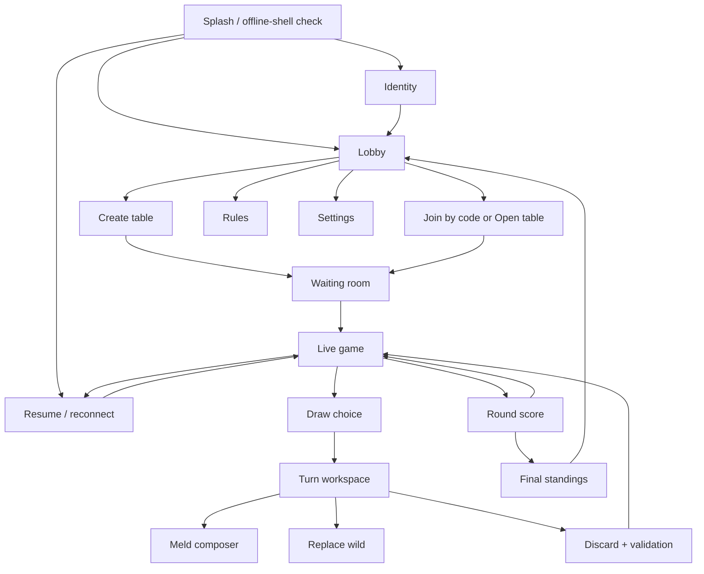

# Crazy Rummy — Phone-first app layout

## Purpose and product boundary

Crazy Rummy is a remote multiplayer, installable PWA for a 13-hand game of
Crazy / Railway Rummy. Each player uses their own phone. Players do **not** need
to be in the same room, and no phone acts as the shared display.

**Crazy Rummy** is the working product name. The target is all practical modern
phones in the same installable-PWA spirit as Murder Darts: Android Chrome is
the primary QA browser, with modern iPhone Safari supported as a first-class
phone target. Layout, input, safe areas, lifecycle recovery, and PWA behaviour
must be checked on both. This is not a promise to support every historic
handset, abandoned browser, or operating-system version.

This document defines the visual system, navigation, interaction states, and
client-facing session interfaces. It deliberately does not choose a backend
provider or transport. “Poll”, “refresh”, “subscribe”, “send”, and “resume”
below describe capabilities the UI needs from an eventual online session
boundary, not an implementation decision.

The cached app shell, rules, settings, and the last safely received match view
remain available offline. Creating, finding, joining, or advancing an online
match requires a connection to a shared service. The app must never imply that
players can discover each other through local-only browser storage.

## Reference-app family resemblance

The design should feel related to Murder Darts and follow the layout discipline
proposed for Fuel & Burn:

- A centered, portrait-first app shell with safe-area padding, a 320 px minimum
  layout, and a comfortable content maximum on larger screens.
- Near-black page depth, layered olive surfaces, warm cream text, fine edge
  highlights, inset shadows, and restrained green, red, and gold accents.
- A small uppercase context label, strong screen title, and a compact
  top-right **Menu** or context action on detail screens.
- Large stacked action cards and full-width primary actions instead of a
  permanent bottom navigation bar.
- At least 44 × 44 CSS-pixel controls; 48–56 px is preferred for the live game.
- Press, focus, loading, selected, disabled, success, warning, error, stale, and
  offline treatments designed as first-class states.
- A cached PWA shell that opens quickly and explains which features need a
  connection.

Crazy Rummy gets its own identity: **a night train card room**. Green baize is
the main field, railway-ticket perforations divide metadata, a thin route line
tracks the 13 hands like stations, and card backs use a geometric rail-lattice
pattern. Avoid literal steam-train nostalgia, casino neon, fake wood, glossy
slot-machine effects, and ornate card faces that harm recognition.

## Visual tokens

Use the Murder Darts palette as a starting family, then tune the role names for
cards and network play.

| Role | Reference value | Use |
| --- | --- | --- |
| Page depth | `#0b0d0e` | App background and overscroll |
| Deep panel | `#151817` | Header, modal, waiting room |
| Baize surface | `#1c2a23` | Shared table and action cards |
| Raised surface | `#26332b` | Selected rows, hand tray, sheets |
| Strong edge | `#424a43` | Boundaries and disabled controls |
| Warm cream | `#f7f2e9` | Primary text and pale card faces |
| Muted cream | `#bdb5a6` | Supporting text |
| Rail green | `#0d7a52` | Connected, legal, ready, positive |
| Bright green | `#38c286` | Current turn and successful action |
| Signal red | `#c94b4b` | Destructive action, invalid/error |
| Bright red | `#ef6b61` | Urgent reconnect or discard warning |
| Ticket gold | `#e2b542` | Primary action, focus, active station |
| Ink | `#101211` | Text on gold/cream controls |

Colour is never the only state signal. Pair it with an icon, label, border
shape, and/or pattern. Red and green playing-card suits retain familiar suit
symbols and labels; do not recolour suits in a way that makes hearts and
diamonds ambiguous.

Typography should use a highly legible system sans for controls and game state.
Optional condensed display lettering may appear in the wordmark and station
numbers only. Tabular numerals are preferred for scores, card counts, hand
numbers, and reconnect timers.

Use three elevation levels:

1. **Field** — page and table background.
2. **Tactile card** — inset top highlight, 1 px edge, short shadow.
3. **Decision sheet** — stronger shadow and scrim, used for card composition,
   validation, rules, and confirmations.

Card faces must be visually distinct from app panels: cream face, dark ink,
clear corner rank/suit, large centre suit, and a strong selected outline.
Jokers/wild cards also include the word **WILD**. Never identify a card only by
colour or artwork.

## Navigation model

- First launch: splash → identity → lobby.
- Returning, not in a match: brief splash → lobby.
- Returning with an unfinished match: brief splash → reconnect/resume gate.
- Lobby is the online home and main menu. It refreshes discoverable online
  players and **Open tables**, shows data freshness, and offers **Create table**,
  **Join with code**, **Rules**, and **Settings**.
- The live game is one focused workspace. A sticky hand tray and action dock
  replace global navigation while a turn decision is underway.
- The top-right **Menu** sheet contains rules, match details, accessibility,
  report issue, and leave-match actions. Leaving is clearly different from
  temporarily closing or losing connection.
- System Back closes a sheet first, then returns to the prior safe screen. It
  must not discard, leave a match, or abandon a composed meld without a
  confirmation.



## Shell and persistent live-game regions

### Standard detail shell

```text
┌────────────────────────────────┐
│ ONLINE PLAY               Menu │
│ Lobby                          │
│                                │
│ [ screen-specific status ]     │
│                                │
│ ┌────────────────────────────┐ │
│ │ Primary content/action     │ │
│ └────────────────────────────┘ │
│ ┌────────────────────────────┐ │
│ │ Secondary content/action   │ │
│ └────────────────────────────┘ │
│                                │
│ [       Primary action       ] │
└────────────────────────────────┘
```

The context label stays small but readable. The title wraps without colliding
with the menu control at 200% text. Content scrolls; the top area need not be
sticky outside the live game.

### Live-game shell

```text
┌────────────────────────────────┐
│ H 04/13 · 2 sets         Menu  │
│ ● Sam's turn · 01:12            │
├────────────────────────────────┤
│ TABLE                          │
│ Pat  11   Lee  9   Jo  10      │
│                                │
│  [ 7♥ 8♥ 9♥ ]   [ Q♣ Q♦ Q♥ ]  │
│            Discard: [ 4♠ ]     │
│ Stock: 52                      │
├────────────────────────────────┤
│ YOUR HAND · 10                 │
│ [3♣][4♣][5♦][J★][Q♠] …         │
│ Sort: [Suit] [Rank] [Custom]   │
├────────────────────────────────┤
│ [Draw stock] [Take discard]    │
│ Turn: Draw → Play → Discard    │
└────────────────────────────────┘
```

The header, shared table viewport, private hand tray, and current action dock
are separate semantic regions. On short phones the shared table scrolls inside
its region only when necessary; the active hand and current action must remain
reachable. Do not shrink cards below legibility to force everything into one
view.

## Screen specifications

## 1. Splash and startup routing

```text
┌────────────────────────────────┐
│                                │
│       ╭─ RAIL / CARD MARK ─╮   │
│       │  CRAZY RUMMY       │   │
│       ╰──── 13 stops ──────╯   │
│                                │
│          Taking your seat…     │
│                                │
│      [Continue] (if delayed)   │
└────────────────────────────────┘
```

Keep automatic splash motion under 1.2 seconds after assets are ready; do not
repeat a three-second brand animation on every resume. Route only after local
startup state is known:

- no identity → identity;
- pending match token → reconnect;
- otherwise → lobby.

Offline startup copy: **“You’re offline. Rules and your last received table are
available; online play will resume when you reconnect.”** Provide **View last
table**, **Rules**, and **Try again** as applicable.

## 2. Identity

```text
┌────────────────────────────────┐
│ YOUR SEAT                 Rules│
│ What should players call you?  │
│                                │
│ Display name                   │
│ [ Alex                       ] │
│                                │
│ Seat marker                    │
│ [ A ] [ B ] [ C ] [ D ]        │
│ Markers include shape + colour │
│                                │
│ [       Save and continue    ] │
│ No account choice is implied.  │
└────────────────────────────────┘
```

Explain the actual identity model once it is chosen during implementation.
Until then, UI language must not promise accounts, passwords, cross-device
sync, permanent friends, or verified names. A display name and non-secret
visual marker are the minimum interface fields.

Validation is inline and preserves the typed value. Reserve layout space for
name collision or moderation feedback. Copy examples: **“That name is already
at this table. Add an initial or choose another.”** and **“Use 1–24 visible
characters.”**

## 3. Lobby: polling for online players and open tables

```text
┌────────────────────────────────┐
│ ONLINE PLAY               Menu │
│ Lobby                          │
│ Alex · ● Online                │
│                                │
│ [ Create a table             ] │
│ [ Join with a code           ] │
│                                │
│ OPEN TABLES        3 · just now│
│ ┌────────────────────────────┐ │
│ │ Night Train · 3/6          │ │
│ │ Host Pat · Hand not started│ │
│ │ [Join table]               │ │
│ └────────────────────────────┘ │
│                                │
│ PLAYERS ONLINE      5 · 8s ago │
│ ● Lee  ● Jo  ● Sam  ◌ Mina     │
│                                │
│ [ Refresh now ]                │
│ Auto-refresh on · every ~5s    │
└────────────────────────────────┘
```

The lobby requests a presence/table snapshot on entry, on visible-window
resume, after a join/create result, and at a bounded foreground refresh
interval. It pauses routine polling when backgrounded or offline. The exact
interval is an implementation configuration; the interface should tolerate
slow or throttled refreshes.

Always label freshness:

- **Updating…** while preserving the last list;
- **Just now** / **18s ago** for a healthy snapshot;
- **May be out of date · 1m ago** with a gold stale marker;
- **Offline · showing results from 19:42** with an explicit retry;
- **Couldn’t refresh** with last good data retained and **Try again**.

An empty result must say **“No open tables found right now”**, not “Nobody is
online.” Online-player presence can be approximate. A player marked online is
not guaranteed still to be available when invited or joined.

**Open tables** are the primary discovery object. An Open table is publicly
listed and joinable, subject to its available seats and host controls. A
**Closed table** never appears in the public list and can be reached only by
its join/invite code or link. Online players are informational or inviteable
only if the eventual session boundary supports invitations. Never imply that
the player list itself grants access to a Closed table.

## 4. Create table

```text
┌────────────────────────────────┐
│ NEW TABLE                 Lobby│
│ Create a match                 │
│                                │
│ Table name                     │
│ [ Night Train               ] │
│ Seats                          │
│ [ 3 ] [ 4 ] [ 5 ] [ 6 ]        │
│ Audience                       │
│ (•) Open table                 │
│     Publicly listed/joinable   │
│ ( ) Closed table               │
│     Join/invite code only      │
│ Rules preset                   │
│ [ Crazy Rummy · 13 hands   ▾ ] │
│                                │
│ [         Create table       ] │
└────────────────────────────────┘
```

Only expose rule toggles that the confirmed rules contract supports. Before
creation, show a compact review link, **View rules for this table**. Creating
has a single-submit loading state and an idempotent interface expectation:
repeated taps must not create multiple visible tables.

Audience is a per-table host choice:

- **Open table** — publicly listed and joinable while a seat is available,
  subject to host controls such as removal, closing, and starting play.
- **Closed table** — not publicly listed; players can join only with the
  table's join/invite code or link.

The review step repeats the chosen audience in plain language. Do not use the
vague labels **Visibility**, **Listed**, **Private**, or **Code only** without
the Open/Closed explanation.

Failure copy distinguishes actionable causes:

- **“You’re offline. Reconnect to create a table.”**
- **“The table wasn’t created. Your choices are still here.”**
- **“That table name needs changing.”**

## 5. Join table

Join can begin from an Open-table card, a received invite link, or a short
join/invite code. A Closed table is never discoverable from the public lobby.

```text
┌────────────────────────────────┐
│ JOIN TABLE                Lobby│
│ Enter a table code             │
│                                │
│ [ A 7 K 9 Q 2 ]                │
│                                │
│ [ Paste code ]                 │
│ [         Find table         ] │
│                                │
│ NIGHT TRAIN · 4/6              │
│ Hosted by Pat · waiting        │
│ 13 hands · standard rules      │
│ [           Join             ] │
└────────────────────────────────┘
```

Code fields accept pasted text, ignore safe separators/case, and do not split
into inaccessible one-character inputs. Before joining, show table name, host,
occupancy, state, and rules summary. Handle **table full**, **already started**,
**code expired/not found**, **removed by host**, and **name collision** without
clearing identity or code.

## 6. Waiting room (2–6 players)

```text
┌────────────────────────────────┐
│ NIGHT TRAIN              Menu  │
│ Waiting room · code A7K9Q2     │
│ [ Copy code ] [ Share link ]   │
│                                │
│ 1 ◆ Pat        HOST · READY    │
│ 2 ● Alex              READY    │
│ 3 ■ Lee            NOT READY   │
│ 4 + Open seat                  │
│ 5 + Open seat                  │
│ 6 + Open seat                  │
│                                │
│ Rules: 13 hands · View         │
│ [ ✓ I’m ready ]                │
│ Waiting for Lee                │
│ [ Start match ]  host only     │
└────────────────────────────────┘
```

The table updates through the eventual online session boundary; a manual
**Refresh** remains available in the Menu. Show player connection state as
**Here**, **Reconnecting**, or **Away**, separately from **Ready**.

Host capabilities:

- copy/share join details;
- choose a supported seat count before start;
- remove a player with confirmation;
- close the table with confirmation;
- start only when 2–6 occupied seats satisfy confirmed readiness rules.

Guest capabilities:

- toggle ready;
- inspect rules;
- leave the waiting room;
- see exactly what is blocking the start.

For a disconnected non-host, show a visible five-minute reconnect countdown to
everyone at the table, for example **“Lee reconnecting · 04:37 remaining.”**
If they do not return before `00:00`, they are dropped from the table and all
players receive **“Lee was dropped after 5 minutes offline.”**

Host loss pauses the whole match because the host-authoritative P2P design
cannot safely continue without the host's full state. Show **“Match interrupted
— host reconnecting · 04:37 remaining”** and preserve the last safe table
read-only. If the same host returns within five minutes, reconcile and resume.
At `00:00`, abandon the match without a result, invalidate its room, and return
everyone to the Lobby. Do not silently elect or migrate to a replacement host.

## 7. Deal transition and private hand

The deal screen confirms the hand number, moving wild rank, dealer, and opening
order without showing other players’ cards. Crazy Rummy does not add a
different meld contract to each hand: only the wild rank changes.

```text
┌────────────────────────────────┐
│ NEXT STOP · HAND 04 OF 13      │
│                                │
│          FOURS ARE WILD         │
│   Sets: 3–4 of one rank         │
│   Runs: 3+ in one suit          │
│                                │
│ Dealer: Jo discards first       │
│ Then Alex takes the first turn  │
│ [         View my hand       ] │
└────────────────────────────────┘
```

Wild-rank wording and examples come from the confirmed rules model. **View my
hand** is optional acknowledgement, not a synchronization barrier. The dealer
enters a clearly labelled discard-only opening state; every other player sees
**“Jo is choosing the opening discard.”** After that accepted discard, the
player to the dealer’s left receives the first normal draw/play/discard turn.

The basic deal animation sends anonymous card backs from the stock to labelled
seat markers. Only the local player's seven or eight cards may turn face-up and
fan into their hand. Opponents remain anonymous backs/card counts throughout.

Private-hand requirements:

- Only the current player’s card identities appear in their private hand.
- Opponent hands show card counts and connection/turn state only.
- Card identities never appear in accessible names, notifications, logs,
  analytics, URL parameters, share previews, DOM regions intended for
  spectators, reconnect diagnostics, or screenshots generated by the app.
- App-switcher privacy masking is desirable where the platform permits it, but
  must not be promised as universal browser behaviour.
- The server/session boundary must return a player-scoped view; hiding a full
  table payload with CSS is not an acceptable interface design.

## 8. Shared table and draw

At the start of a turn, the action dock names the required step.

```text
┌────────────────────────────────┐
│ YOUR TURN · DRAW               │
│                                │
│ Stock                          │
│ [ patterned back ]  52 cards   │
│ [ Draw from stock ]            │
│                                │
│ Discard pile                   │
│ [ 4♠ ] · placed by Sam         │
│ [ Take 4♠ ]                    │
│                                │
│ You must draw before playing.  │
└────────────────────────────────┘
```

The UI requests a draw as an intent, disables both draw choices while pending,
and commits only the acknowledged result. Never optimistically reveal a stock
card that may not have been awarded. If acknowledgement is uncertain, show
**“Checking whether your draw counted…”** and reconcile the authoritative turn
view before enabling another draw.

On another player’s turn, replace controls with a concise status:
**“Sam is choosing a draw”** and allow hand sorting and rules viewing without
allowing game actions.

## 9. Turn workspace and card selection

After draw, the dock becomes:

```text
[ Make a meld ] [ Add to table ] [ Replace a wild ]
Selected: 0                 [ Clear ]
[                 Discard…                  ]
```

Tap selects a card; a second tap clears it. Selected cards rise slightly and
gain a gold double outline plus a check badge. Long-press is not required.
Keyboard and switch users can reach each card, hear rank/suit/position, toggle
selection, and move cards with explicit controls.

Sorting options are **Suit**, **Rank**, and **Custom**. Automatic sorts are
non-destructive views. Custom reorder supports drag, but also **Move left** and
**Move right** actions. The app must not infer a meld from visual adjacency
without confirmation.

## 10. Meld composer

```text
┌────────────────────────────────┐
│ COMPOSE MELD              Close│
│ New meld                       │
│                                │
│ Selected                       │
│ [ 7♥ ] [ 8♥ ] [ J★ ] [ 10♥ ]   │
│ [←] drag/reorder [→]            │
│                                │
│ Type                           │
│ (•) Run        ( ) Set         │
│ Wild represents: [ 9♥      ▾ ] │
│                                │
│ ✓ Valid run · 7♥ through 10♥   │
│ [          Place meld        ] │
└────────────────────────────────┘
```

The composer is a full-height sheet on phones, not a narrow popover. It
provides local guidance immediately, then submits a meld intent for
authoritative validation. “Looks valid” must not be presented as committed.

Validation states:

- **Incomplete** — neutral helper such as **“Add one more card.”**
- **Locally invalid** — red border and a precise reason.
- **Checking…** — action disabled, selection preserved.
- **Accepted** — meld animates to the shared table and hand count updates.
- **Rejected after sync** — selection remains, latest table is shown, and the
  reason explains what changed.

Example copy:

- **“A set needs matching ranks.”**
- **“This run skips 9♥. Assign a wild or choose another card.”**
- **“That table meld changed while you were composing. Review the latest
  cards.”**

## 11. Add to an existing meld

Tapping a table meld opens a labelled action sheet showing its owner only if
ownership matters to the confirmed rules. Eligible selected cards preview at
the start/end or within the set. The target meld receives a strong patterned
outline; other melds dim slightly but remain readable.

Do not use free-position drag as the only mechanism. Provide **Add before**,
**Add after**, or an explicit destination choice when needed. A rejected add
returns cards to the private hand selection without exposing them to opponents.

## 12. Replace a wild

```text
┌────────────────────────────────┐
│ REPLACE WILD              Close│
│ On table: 7♥ · WILD(8♥) · 9♥   │
│                                │
│ Your matching card             │
│ [ 8♥ ]                         │
│                                │
│ Wild returns to your hand.     │
│ Play it, keep it, or discard   │
│ it under the normal rules.     │
│ [ View exact rule ]            │
│                                │
│ [      Replace wild card     ] │
└────────────────────────────────┘
```

The replacement preview states both movements before confirmation. Once
accepted, the reclaimed wild returns to the private hand and may be played,
held for a later turn, or used as the mandatory discard. The engine imposes no
same-turn reuse requirement.

## 13. Discard and turn validation

Discard is the deliberate end-of-turn action. If no card is selected, opening
**Discard…** asks the player to choose one. If a card is selected:

```text
┌────────────────────────────────┐
│ END YOUR TURN?                 │
│                                │
│ Discard [ Q♠ ]                 │
│ Your table plays are listed:   │
│ • New run: 7♥–10♥              │
│ • Added K♣ to queens set       │
│                                │
│ [ Back to turn ]               │
│ [ Confirm discard ]            │
└────────────────────────────────┘
```

For a routine discard, Settings may allow “tap discard, then confirm” rather
than a second modal, but the card and consequence must remain unmistakable.
Disable repeated submission while checking.

Turn validation returns structured, user-facing reasons and the step that
needs attention. Examples:

- **“Draw a card before you discard.”**
- **“Open with a complete set or run before adding to the table.”**
- **“Play the recovered wild before ending your turn.”**
- **“You cannot discard your final card under this rule.”**
- **“Your turn changed on another device. The latest table has been loaded.”**

Errors focus the affected control, announce via an `aria-live="assertive"`
region when necessary, and preserve legal work. Accepted discard moves the
card to the pile, updates counts, advances the named turn, and announces
**“Turn complete. Sam’s turn.”**

## 14. Reconnect and conflict recovery

Connectivity is persistent but quiet:

- connected: small green dot and **Online**, usually only in Menu/lobby;
- slow/stale: gold line **“Connection slow · last update 18s ago”**;
- disconnected: red persistent banner **“Offline — your table is paused on
  this phone · reconnect within 05:00”** with **Reconnect**;
- reconciling: **“Rejoining Night Train…”** with last safe table visible;
- restored: brief **“Back online · table updated”**;
- guest countdown expired: **“Your seat was dropped after 5 minutes offline”**
  with a safe return to Lobby;
- host disconnected: blocking **“Match interrupted — host reconnecting ·
  04:37 remaining”**;
- host timeout: **“Match ended — the host did not reconnect within 5
  minutes”** with a safe return to Lobby;
- removed/closed/finished elsewhere: a blocking, truthful destination.

```text
┌────────────────────────────────┐
│ RECONNECTING                   │
│ Night Train · Hand 04          │
│                                │
│ Last update received 19:42:08  │
│ Your pending action: Discard Q♠│
│ Seat held for: 04:37            │
│                                │
│ Checking the table before      │
│ sending anything again…        │
│ [ Try now ]                    │
│ [ View last received table ]   │
│ [ Leave match ]                │
└────────────────────────────────┘
```

Never silently repeat a draw, meld, replacement, or discard merely because a
request timed out. Reconnect submits the resume credential plus last received
revision and any pending intent identifier, then renders one of:

- intent committed — show the authoritative resulting state;
- intent not committed — restore the action for explicit retry;
- unknown/conflict — fetch current state, explain it, and require a new choice;
- seat unavailable — explain removal/expiry and return safely to lobby;
- match finished — go to round score or final standings.

The last received table is visibly stamped **Read-only · may be out of date**.
Private cards in the local resume cache require the same protection as the live
hand and must be cleared when the player leaves or the match is irrecoverably
closed.

The non-host reconnect window begins when the host-authoritative table records
that player as disconnected and lasts five minutes. The UI shows `MM:SS`, but
the authoritative expiry is not derived from an individual phone's drifting
countdown. Reconnecting before expiry reconciles state and keeps the seat.
At expiry the non-host is dropped; reopening later returns them to the Lobby
rather than implying their seat still exists.

If the disconnected player is the host, replace the normal guest countdown
with an interrupted-match screen:

```text
┌────────────────────────────────┐
│ MATCH INTERRUPTED              │
│ Night Train                    │
│                                │
│ The host disconnected.         │
│ Waiting for the same host to   │
│ reconnect: 04:37 remaining.    │
│                                │
│ Last safe update: 19:42:08     │
│ [ Try reconnecting ]           │
│ [ View last received table ]   │
│ [ Return to lobby ]            │
└────────────────────────────────┘
```

Keep the last view read-only. If the host returns before expiry, reconcile from
the authoritative snapshot before accepting play. If the countdown expires,
show **“Match ended — the host did not reconnect within 5 minutes”**, invalidate
the old room, and return all remaining players to the Lobby without a recorded
winner. Host migration remains out of scope.

## 15. End of hand and round scoring

```text
┌────────────────────────────────┐
│ HAND 04 COMPLETE               │
│ Jo went out                    │
│                                │
│ THIS HAND        TOTAL         │
│ 1 Jo       0       42          │
│ 2 Alex    18       55          │
│ 3 Pat     26       61          │
│ 4 Sam     41       83          │
│                                │
│ [ How scores were counted ]    │
│ Route: ●●●●○○○○○○○○○  4/13     │
│                                │
│ Waiting for host / Continue    │
└────────────────────────────────┘
```

The scoring screen names who went out, separates this-hand points from running
total, and explains whether lower or higher is better. Card-level score detail
is available to the owning player; shared scoring displays only information
the confirmed rules permit. If all remaining hands are revealed for scoring,
state that transition explicitly.

Every player acknowledges or waits according to the session contract. Do not
let the host start the next hand while a scoring correction is pending.
Corrections, if supported, require an audit-style before/after summary and
notice to all players.

The 13-hand route uses numbered stations, current gold, completed green, future
muted, and an accessible text equivalent: **“Hand 4 of 13.”** At 320 px show a
scrollable or condensed `04 / 13` route rather than 13 illegible dots.

## 16. Final standings

```text
┌────────────────────────────────┐
│ JOURNEY COMPLETE               │
│ Night Train · 13 hands         │
│                                │
│ 1  Jo       184     WINNER     │
│ 2  Alex     207                │
│ 3  Pat      228                │
│ 4  Sam      251                │
│                                │
│ [ View hand-by-hand results ]  │
│ [ Copy result summary ]        │
│ [ Play again ]                 │
│ [ Return to lobby ]            │
└────────────────────────────────┘
```

Celebration is restrained: a gold route-line completion and optional short
haptic. No confetti storm, flashing, sound, or winner-only information. A
copied summary excludes table join credentials and private card history.
**Play again** creates or requests a new waiting-room state; it does not mutate
the finished record invisibly.

## 17. Rules and settings

Rules are cached, version-labelled, searchable by section, and reachable from
the lobby, waiting room, live Menu, validation messages, and result details.
Suggested sections:

- Aim and 13-hand progression
- Turn order: draw, play, discard
- The moving wild rank for each of the thirteen hands
- Sets, runs, suits, aces, and wild cards
- First-meld and lay-off restrictions
- Adding to table melds
- Replacing and replaying wild cards
- Going out
- Scoring and ties
- Table-specific rule choices

The table’s active rules summary is immutable or visibly versioned after play
starts. Interface examples must be marked as examples, never treated as the
rules source.

Settings:

- Display name and seat marker
- Card size: Standard / Large
- Hand sorting default
- Motion: System / Reduced
- Haptics: On / Off (only if available)
- Confirm discard: Always / Quick confirm
- High contrast / suit labels
- Lobby auto-refresh: On / Off, with manual refresh always available
- Install/update/offline status
- Privacy, data, accessibility, and About

## Responsive behaviour

### 320–479 px phones

- One column, 12–14 px shell gutters, safe-area top/bottom padding.
- Top actions wrap below the title instead of truncating.
- Live header prioritises hand, contract, and turn; secondary network details
  move into Menu unless stale/offline.
- Private hand scrolls horizontally with visible continuation affordances.
  Ensure focused cards scroll fully into view.
- Shared melds wrap by meld, never through the middle of a card group.
- Decision sheets fill the viewport and keep the primary action above the
  bottom safe area.

### 480–719 px large phones / portrait tablets

- Preserve one-handed hierarchy; allow wider card fan and two-column lobby
  metadata where it does not reorder reading.
- Waiting-room seats may form a 2-column grid.

### 720 px and above

- Center within roughly 920 px.
- Lobby/create screens may use a 2-column content layout.
- Live game may place shared table above or beside a wider private-hand tray,
  but private and public regions remain unmistakable.
- Landscape tablet can show table left and hand/actions right. Do not expose
  additional private information merely because space is available.

Viewport resize, rotation, virtual keyboard, browser chrome changes, and
fold/hinge safe areas must not hide the active card, validation message, or
primary action.

## Accessibility requirements

- WCAG 2.2 AA contrast is the baseline; test cream on every olive surface,
  muted text, gold controls, red errors, green success, focus rings, and card
  suit colours.
- Support 200% text without loss of content/action and browser zoom to 400% in
  an appropriate reflow view.
- Use semantic headings, landmarks, lists, forms, dialogs, status regions, and
  buttons. Never make a bare `div` the only card control.
- Maintain a logical reading order: status → shared table → private hand →
  actions. Visual card reordering updates accessible position labels.
- Each card name includes rank and suit, selection, and hand position, e.g.
  **“Queen of spades, selected, card 4 of 11.”**
- Melds have text summaries, e.g. **“Run: seven through ten of hearts, wild as
  nine.”**
- Live announcements are concise. Do not announce every polling tick or every
  opponent animation. Announce turn changes, connection loss/restoration,
  accepted actions, blocking validation, and hand completion.
- A reconnect countdown has a persistent visible `MM:SS` value and an
  accessible text label such as **“Four minutes thirty-seven seconds remain to
  reconnect.”** Do not announce every second; announce entry into the
  five-minute window, the one-minute warning, successful reconnection, and
  expiry/drop. Host loss is announced as **“Match interrupted. The host has
  five minutes to reconnect.”** Announce the one-minute warning, recovery, or
  abandonment without reading every second.
- Focus moves into sheets and returns to the invoking control. Reconnect places
  focus on the status heading only when it blocks play.
- Touch targets are at least 44 × 44 px with 8 px separation where practical.
  Card overlap cannot reduce the accessible hit target below the minimum.
- Provide non-drag alternatives for reorder, meld placement, and wild
  replacement.
- Do not rely on hover, long-press, swipe, motion, colour, haptic, or sound.
- Support forced colours and increased contrast. Preserve borders and selection
  checks when background images disappear.
- Use standard suit symbols plus spoken suit names. A “four-colour deck”
  preference may be added only with redundant symbols/labels.

## Interaction states and concurrency

Every network-changing action has the sequence:

```text
ready → selected/composed → submitting → acknowledged | rejected | uncertain
```

- **Submitting:** disable only conflicting actions, retain readable state, show
  a labelled progress indicator, and prevent duplicate intent.
- **Acknowledged:** render the authoritative revision; a short local animation
  may connect origin and destination.
- **Rejected:** preserve user work where safe and explain the exact correction.
- **Uncertain:** block repetition, reconcile, then state whether the action
  happened.

Shared objects carry a revision/state identity at the interface boundary.
Stale-table rejection is expected during simultaneous play/reconnect and must
be a recoverable UX state, not a generic crash.

Required designed states for each core screen: initial, loading, partial,
empty, success, stale, offline, recoverable error, blocking error, disabled,
long names, 6 players, 320 px, 200% text, keyboard-only, forced colours,
reduced motion, and reconnect after background suspension.

## Motion and haptics

- Fast press/focus: 120–160 ms.
- Sheet entry/state transition: 180–240 ms.
- Card-to-table placement: at most 300 ms and only after acknowledgement.
- The basic card-motion set is:
  - **Shuffle/deal:** a short stock shuffle, then anonymous backs travel to seat
    markers; only the local hand turns face-up and fans into place.
  - **Draw:** the accepted stock or discard card travels into the local hand
    and nearby cards reflow.
  - **Discard:** the accepted selected card travels to the top of the discard
    pile, followed by the current-turn highlight moving to the next player.
  - **Meld/lay-off:** accepted selected cards travel together to their final
    table slots and settle with a small scale response.
  - **Replace wild:** the natural card enters the wild's exact slot and the
    reclaimed wild returns to the local hand, where it may be played, held, or
    discarded under the normal turn rules.
  - **Sort:** cards reflow to rank/suit order without a flip.
  - **Hand complete:** the thirteen-stop route advances once; the final winner
    receives a restrained gold route-line finish.
- Card travel must use compositor-friendly `transform` and `opacity` where
  practical, remain interruptible, and never delay the next legal action.
- Animation begins only after the corresponding authoritative event is
  acknowledged. A pending network command may show progress but must not
  animate a card into a destination that is not yet accepted.
- No looping animation except a subdued progress indicator while activity is
  genuinely ongoing.
- Never animate opponent private cards or imply their identities during deal.
- `prefers-reduced-motion` removes travel, fan, flip, route-drawing, and
  celebratory movement; use immediate state change or a short opacity change.
- Haptics, when supported and enabled: light selection, accepted discard/turn,
  reconnect restored, and hand complete. Use a distinct but not punitive
  warning for a destructive leave confirmation only.
- Never use haptic/sound as the only feedback. No autoplay audio.

## Offline shell, privacy, and hidden-information checklist

- Cache shell, install assets, rules, settings, and suitable non-secret static
  content.
- Label online-only actions while offline; do not queue table creation/join.
- Do not queue ambiguous game-changing intents for blind background replay.
- Cache only the minimum resumable player-scoped match view.
- Clear private match cache on confirmed leave, removal, expiry, or explicit
  local-data clear.
- Never place table codes, resume credentials, player tokens, or card identities
  in share previews, logs, analytics events, error text copied to clipboard, or
  URLs unless a deliberate join-link contract safely requires a non-secret
  table code.
- Opponents receive counts and shared plays, never another player’s private
  hand.
- A spectator mode, if added later, must use a separate public projection; it
  cannot reuse a player view.
- Notifications must say **“It’s your turn at Night Train”**, not name the
  drawn card or private hand.

## Recommended interface copy

| Situation | Copy |
| --- | --- |
| Lobby loading | **Looking for open tables…** |
| Lobby empty | **No open tables found right now. Create one or refresh.** |
| Lobby stale | **Results may be out of date · last checked 1 minute ago.** |
| Waiting | **3 players ready · waiting for Lee.** |
| Guest ready | **You’re ready. The host can start when everyone is set.** |
| Not your turn | **Sam’s turn · you can sort your hand while you wait.** |
| Draw required | **Your turn. Draw from the stock or take the discard.** |
| Intent uncertain | **Checking whether that move counted…** |
| Guest offline during turn | **You’re offline. Don’t repeat the move yet · reconnect within 05:00.** |
| Other guest offline | **Lee reconnecting · 04:37 remaining.** |
| Guest timeout | **Lee was dropped after 5 minutes offline.** |
| Host reconnecting | **Match interrupted — host reconnecting · 04:37 remaining.** |
| Host timeout | **Match ended — the host did not reconnect within 5 minutes.** |
| Reconnected | **Back online · your table is up to date.** |
| Hand complete | **Jo went out. Hand 4 scores are ready.** |
| Finished | **Journey complete · final standings.** |

Avoid **syncing** when **checking**, **updating**, or **rejoining** is clearer.
Avoid blaming players for slow connections. Avoid “invalid move” without the
specific rule and repair.

## Focused flow verification

### Host: first launch through one complete hand

1. Splash identifies no saved player and opens Identity.
2. Host enters a display name, saves, and lands in Lobby.
3. Lobby snapshot loads with freshness; host chooses **Create a table**.
4. Host sets 2–6 seats, chooses **Open table** (publicly listed/joinable subject
   to host controls) or **Closed table** (join/invite code only), selects the
   confirmed rules preset, reviews the audience, then submits once.
5. Waiting room shows a shareable code/link, occupied/open seats, ready and
   connection states.
6. At least two guests join. Host sees what blocks start, then **Start match**
   becomes enabled under the rules contract.
7. Deal transition names hand 1 contract, dealer, and first player without
   exposing any private card.
8. Host views only their own hand, waits or takes a turn, draws exactly once,
   composes/places legal cards if desired, chooses a discard, reviews turn
   summary, and receives authoritative acceptance.
9. Shared table, hand counts, discard, and named active turn update for all
   players.
10. One player goes out. The round screen shows permitted hand score, running
    totals, explanation, and `1 / 13` progress.
11. Host cannot start the next hand while required acknowledgement/correction
    remains. The full-hand finish is complete when the authoritative score and
    next-hand readiness state agree on every client.
12. If a non-host disconnects, the host sees the same five-minute countdown and
    the player either resumes their seat or is dropped at expiry. If the host
    connection is lost, all clients enter **Match interrupted** with the same
    five-minute recovery window. The match resumes only if that host returns;
    otherwise it is abandoned without a result.

### Guest: first launch, join, reconnect, and finish the hand

1. Splash opens Identity; guest saves a display name and reaches Lobby.
2. Lobby polling finds the host’s **Open table**, or the guest opens Join from
   an Open/Closed table code or invite link. A Closed table never appears in
   public results.
3. Preview confirms table, host, occupancy, and rule summary before guest joins.
4. Waiting room shows the guest’s seat. Guest marks ready and sees the precise
   waiting reason.
5. Deal transition and live table show opponent counts/shared melds but only
   the guest’s private hand.
6. During the guest’s turn, they draw. Immediately after requesting a meld or
   discard, their connection drops before acknowledgement.
7. Offline banner blocks duplicate submission and retains the last safe view
   with a timestamp and visible five-minute reconnect countdown. The app does
   not assume whether the move succeeded.
8. Reconnect sends resume context and reconciles the pending intent. If
   committed, it renders the resulting authoritative turn; if not, it restores
   an explicit retry; if conflicted, it explains the latest table. Reconnecting
   before `00:00` retains the seat; expiry drops this non-host and returns them
   safely to Lobby.
9. The guest continues or observes until a player goes out. Round scoring
   separates hand and total, gives an accessible explanation, and shows hand
   `1 / 13`.
10. Backgrounding and reopening routes through the same resume gate and never
    exposes another player’s cards.

### Verification acceptance gates

- Both paths can complete without assuming players share a room or device.
- Lobby discovery visibly refreshes/polls and communicates freshness, empty,
  stale, offline, and failure states.
- Open tables are publicly listed/joinable subject to host controls; Closed
  tables are absent from public results and use a join/invite code only.
- A game cannot start outside 2–6 supported occupied seats.
- Every turn communicates draw → optional play → discard and prevents
  duplicate/uncertain actions.
- Meld composition, wild replacement, and turn rejection preserve actionable
  context.
- No host-only action is available to a guest; no guest is trapped waiting
  without a stated reason.
- Reconnect reconciles rather than blindly replaying.
- A non-host has a visible, accessible five-minute reconnect countdown and is
  dropped at expiry. Host loss pauses the whole match for five minutes and then
  abandons it without a result; no host-drop or automatic migration is implied.
- Private card identities never cross the player-scoped view boundary.
- The hand finishes in authoritative round scoring and advances the visible
  13-hand route.
- All critical flow steps remain operable at 320 px, 200% text, keyboard-only,
  reduced motion, and without haptics.
- Primary QA covers modern Android Chrome and modern iPhone Safari; support is
  not claimed for every historic phone/browser combination.

## Phase 0 asset and design-state package

Before implementation polish, prepare:

- wordmark and compact rail/card mark;
- any-purpose and maskable PWA icons plus monochrome favicon;
- CSS/SVG card-back lattice and subtle baize/rail-line textures;
- accessible card-face component for every rank/suit plus wild;
- seat markers with colour + shape + label;
- stock, discard, connection, ready, host, lock/listed, rules, copy/share,
  refresh, warning, and reconnect icons in one stroke family;
- 13-station progress variants for narrow and wide layouts;
- empty lobby, offline, reconnect, and finished-state illustrations;
- phone frames for 320 × 568, 390 × 844, and 430 × 932;
- tablet/desktop reflow at 768 and 920 px;
- visual states for standard, loading, empty, stale, offline, error, pending
  intent, long text, high contrast, and reduced motion.

Decorative assets must be removable without hiding content, controls, status,
or rules. Source assets should be original or have documented licences and be
available from the offline shell where used.
